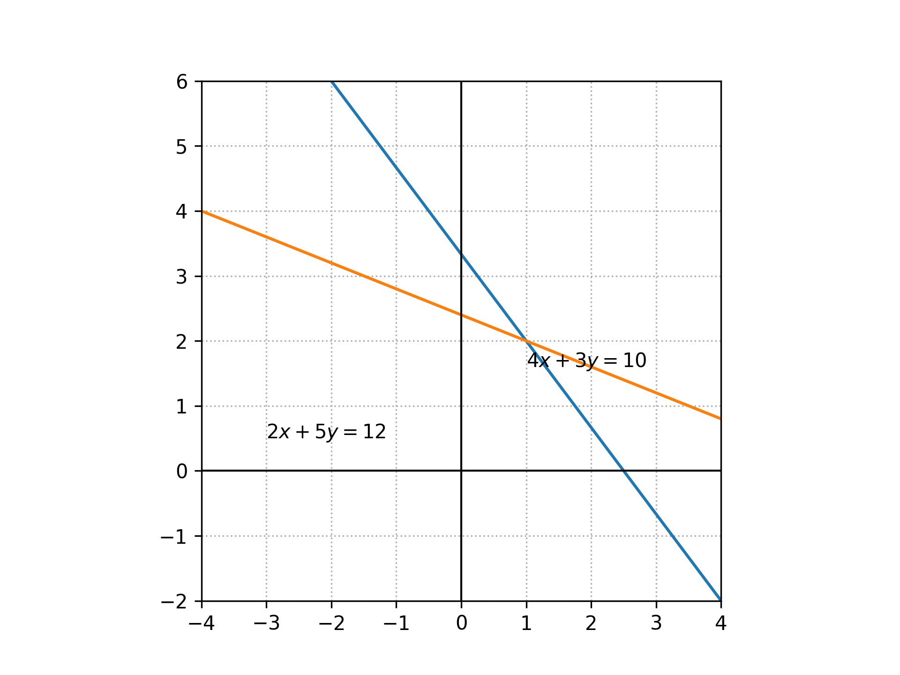
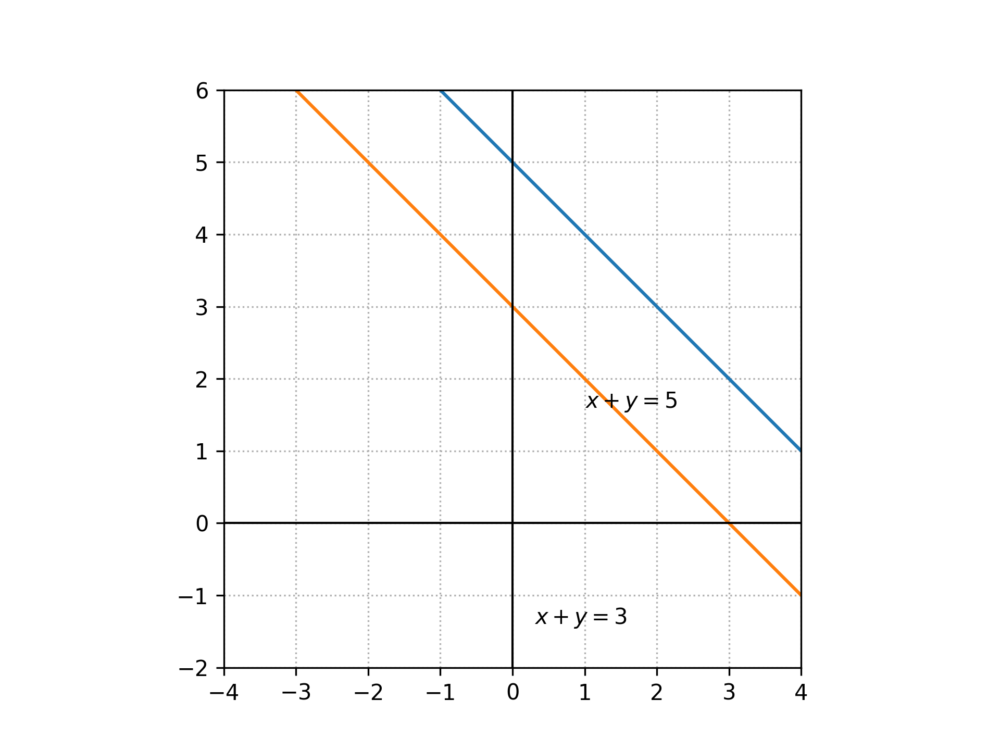
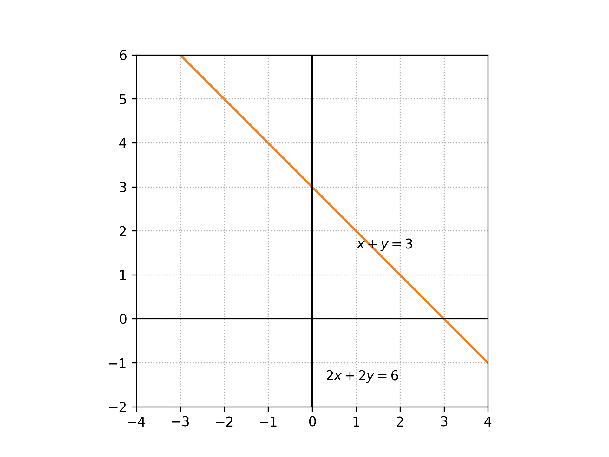

# Sistem Persamaan Linier

### Pengenalan Sistem Persamaan Linier
Sistem Persamaan Linier sering kali disebutkan juga dengan Persamaan Linier, padahal definisi dari keduanya berbeda. **Sistem persamaan linier** merupakan gabungan dari beberapa persamaan linier, sedangkan **persamaan linier** merupakan persamaan garis lurus. 

Untuk **linier** sendiri berarti menggambarkan **garis lurus**, jika **non-linier** menggambarkan **garis melengkung**. Ini dapat di tandai dengan persamaan itu sendiri, jika linier maka pada persamaan pangkatnya tidak lebih dari satu, sedangkan untuk non-linier pada persamaannya pangkatnya lebih dari satu.

**$2x+6y=4$** 

contoh di atas merupakan linier dan akan menghasilkan garis lurus.

**$2x^2-5y^3=12$** 

sedangkan contoh di atas merupakan non-linier dan akan menghasilkan garis melengkung.


**Persamaan Linier** merupakan persamaan yang menggambarkan hubungan linier antara variable-variablenya. Bentuk persamaan linier seperti $ax + by + cz + .... = d$, dimana $a, b, c$ merupakan koefisien; $x, y, z$ merupakan variable dan $d$ merupakan konstanta.

Contoh persamaan linier :

**$2x + 3y = 12$**

Dari persamaan linier tersebut akan membentuk suatu garis lurus.


**Sistem Persamaan Linier** merupakan kumpulan beberapa persamaan linier yang saling berkaitan, dan tujuannya adalah mencari nilai variabel yang memenuhi semua persamaan dalam sistem tersebut. Sistem ini bisa memiliki dua atau lebih persamaan linier, dan solusinya adalah nilai-nilai variabel yang memenuhi setiap persamaan dalam sistem tersebut.

contoh sistem persamaan linier : 

**$2x + 3y = 6$**

**$x - y = 1$**


Sistem ini terdiri dari dua persamaan linier, jadi kita harus mencari nilai x dan y yang memenuhi dua persamaan tersebut.

# Macam-Macam Penyelesaian

### Sistem Penyelesaian Tunggal

Sistem persamaan linier dikatakan memiliki penyelesaian tunggal jika semua persamaan berpotongan pada satu titik.

Sistem ini memiliki satu solusi unik yang memenuhi semua persamaan dan tidak ada persamaan yang bergantungan satu sama lain.

contoh :

$$ 4x + 3y = 10 $$

$$ 2x + 5y = 12 $$

- Penyelesaian : 

<iframe scrolling="no" title="Simultaneous Equations:Elimination" src="https://www.geogebra.org/material/iframe/id/MXa3HKy3/width/977/height/574/border/888888/sfsb/true/smb/false/stb/false/stbh/false/ai/false/asb/false/sri/true/rc/false/ld/false/sdz/true/ctl/false" width="977px" height="574px" style="border:0px;"> </iframe>

```
%matplotlib inline
import numpy as np
import matplotlib.pyplot as plt

fig, ax = plt.subplots()
ax.plot(x,(10-4*x)/3)
ax.plot(x,(12-2*x)/5)

ax.text(1,1.6,'$4x+3y = 10$')
ax.text(-3,0.5,'$2x+5y = 12$')

ax.set_xlim(-4,4)
ax.set_ylim(-2,6)
ax.axvline(color='k',linewidth = 1)
ax.axhline(color='k',linewidth = 1)

## This options specifies the ticks based the list of numbers provided.
ax.set_xticks(list(range(-4,5)))
ax.set_aspect('equal')
ax.grid(True,ls=':')
```


Dalam persamaan pertama dan persamaan kedua mewakili dua garis yang berpotongan dalam satu titik.


### Sistem Tidak Ada Penyelesaian

Sistem tidak ada penyelesaian artinya tidak ada variable yang bisa memenuhi semua persamaan dalam sistem tersebut.
Persamaan dalam sistem ini selalu bertentangan satu sama lain sehingga tidak mungkin memiliki solusi. Dalam 2 dimensi persamaan tersebut tidak akan memiliki titik potong.

contoh :

$$x + y = 5 $$

$$x + y = 3 $$

- Penyelesaian :

<iframe scrolling="no" title="Simultaneous Equations:Elimination" src="https://www.geogebra.org/material/iframe/id/MXa3HKy3/width/977/height/574/border/888888/sfsb/true/smb/false/stb/false/stbh/false/ai/false/asb/false/sri/true/rc/false/ld/false/sdz/true/ctl/false" width="977px" height="574px" style="border:0px;"> </iframe>


```
%matplotlib inline
import numpy as np
import matplotlib.pyplot as plt

fig, ax = plt.subplots()
ax.plot(x,(5-x)/1)
ax.plot(x,(3-x)/1)

ax.text(1,1.6,'$x+y = 5$')
ax.text(0.3,-1.4,'$x+y = 3$')

ax.set_xlim(-4,4)
ax.set_ylim(-2,6)
ax.axvline(color='k',linewidth = 1)
ax.axhline(color='k',linewidth = 1)

## This options specifies the ticks based the list of numbers provided.
ax.set_xticks(list(range(-4,5)))
ax.set_aspect('equal')
ax.grid(True,ls=':')
```




Dalam kasus tersebut, pada persamaan pertama $x + y = 5$ dan pada persamaan kedua $x + y = 3$. Ini bertentangan karena tidak mungkin $(x+y)$ bernilai dua angka berbeda pada waktu bersamaan. 

Jadi dalam grafik ini dua garis yang mewakili persamaan tersebut tidak akan berpotongan.


### Sistem Penyelesaian Tak Terhingga

Sistem penyelesaian tak terhingga artinya ada banyak nilai untuk variabel yang dapat memenuhi semua persamaan dalam sistem tersebut. Persamaan persamaan ini bergantung satu sama lain, sehingga penyelesaiannya tak terbatas pada satu titik saja.

contoh :

$$ x + y = 3 $$

$$ 2x + 2y = 6 $$

- Penyelesaian :

<iframe scrolling="no" title="Simultaneous Equations:Elimination" src="https://www.geogebra.org/material/iframe/id/MXa3HKy3/width/977/height/574/border/888888/sfsb/true/smb/false/stb/false/stbh/false/ai/false/asb/false/sri/true/rc/false/ld/false/sdz/true/ctl/false" width="977px" height="574px" style="border:0px;"> </iframe>


```
%matplotlib inline
import numpy as np
import matplotlib.pyplot as plt

fig, ax = plt.subplots()
ax.plot(x,(3-x)/1)
ax.plot(x,(3-x)/1)

ax.text(1,1.6,'$x+y = 3$')
ax.text(0.3,-1.4,'$2x+2y = 6$')

ax.set_xlim(-4,4)
ax.set_ylim(-2,6)
ax.axvline(color='k',linewidth = 1)
ax.axhline(color='k',linewidth = 1)

## This options specifies the ticks based the list of numbers provided.
ax.set_xticks(list(range(-4,5)))
ax.set_aspect('equal')
ax.grid(True,ls=':')
```




Dalam kasus ini persmaan pertama dan persamaan kedua saling berkaitan maka akan menghasilkan garis yang sama. Dalam hal ini, semua titik pada garis tersebut adalah solusi dari sistem persamaan linier tersebut, yang berarti sistem ini memiliki solusi yang tak terhingga banyaknya.


